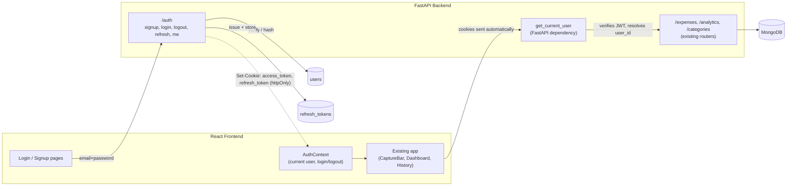
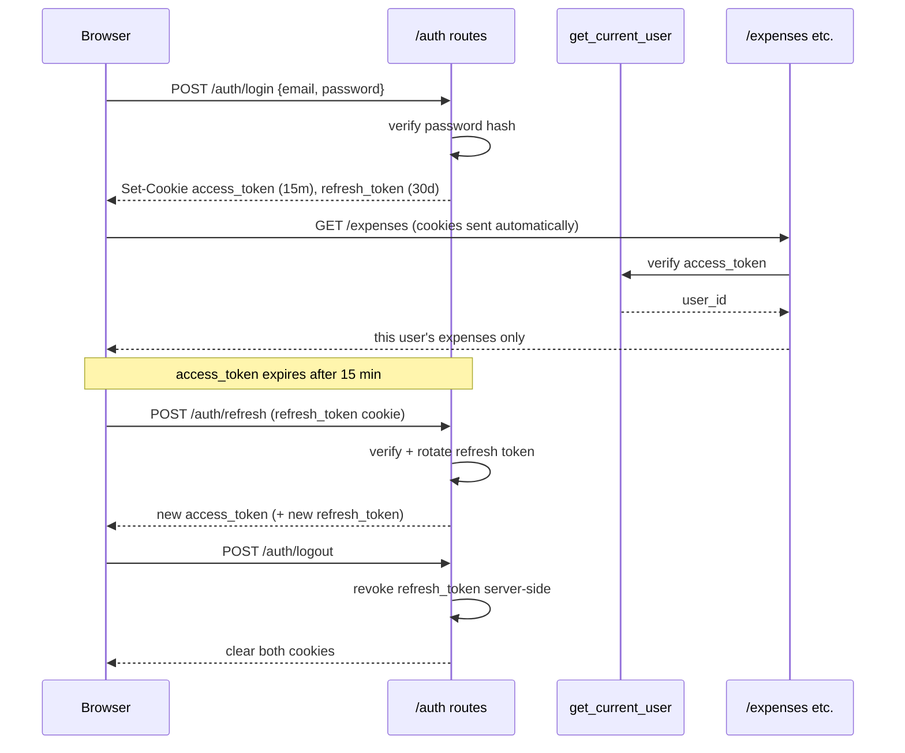

# Multi-User Auth — Architecture & Build Plan

## 1. Goal

Move the app from single hardcoded user (`user_id: "nitin"`, see [PLAN.md](PLAN.md) §5, §9)
to a real multi-user system: anyone can sign up with email + password, log in, and see
only their own expenses. Because this handles personal financial data, auth needs to be
done properly, not bolted on — correct password storage, short-lived credentials,
CSRF-aware cookie handling, and a clear migration path for the data that already exists
under `user_id: "nitin"`.

This plan only covers auth/multi-tenancy. It does not change the expense-parsing,
analytics, or UI features already built — it changes *who* they run for.

---

## 2. Current State (what this replaces)

- `backend/config.py` has `default_user_id: str = os.getenv("DEFAULT_USER_ID", "nitin")`.
- Every route in `routers/expenses.py` and `routers/analytics.py` filters MongoDB queries
  by `settings.default_user_id` — there's no per-request identity at all, it's a constant.
- The frontend never sends or stores any identity — it just calls the API.
- `categories` collection is global/shared (no `user_id`), which is fine and stays that way.

The good news: because every expense document already carries a `user_id` string field
and every query already filters on it (per PLAN.md §9's "design `user_id` into every
document from day one"), the multi-tenancy plumbing is already in place. This plan
replaces the *source* of `user_id` (a hardcoded constant → the authenticated caller)
rather than introducing filtering that doesn't exist yet.

---

## 3. Security Requirements (non-negotiable for this feature)

- Passwords are never stored or logged in plaintext — hashed with a modern KDF
  (Argon2id), never MD5/SHA/bcrypt-only-with-no-salt-management.
- Auth tokens live in `httpOnly` cookies, not `localStorage` — this is a JS app pulling
  in a third-party LLM SDK and eventually charts/date libs; any of those (or a future
  dependency) having an XSS bug should not mean a stolen session token. `localStorage`
  is readable by any script on the page; an `httpOnly` cookie is not.
- Access tokens are short-lived (minutes); a separate, rotating refresh token
  (also `httpOnly`) is used to mint new access tokens, and refresh tokens are revocable
  server-side (logout actually invalidates something, not just "forget the client copy").
- Login/signup endpoints are rate-limited — auth endpoints are the #1 brute-force target.
- Every existing data endpoint's `user_id` comes from the verified token, never from a
  request body/query param the client could forge.
- CORS stays locked to the configured frontend origin (`CORS_ORIGINS`, already in
  `backend/.env`) with `allow_credentials=True` (already set in `main.py`) — required for
  cookies to flow between `localhost:5173` and `localhost:8000`.
- No secrets (JWT signing key, DB URI, Gemini key) ever leave `backend/.env` /
  `.env.example` stays placeholders-only, per the existing repo convention.

---

## 4. Architecture



### Token flow (login → using the app → refresh → logout)



---

## 5. Data Model Additions

### `users` collection (new)

```jsonc
{
  "_id": ObjectId,
  "email": "nitin@example.com",       // lowercased, unique index
  "password_hash": "$argon2id$...",    // argon2id, never plaintext
  "display_name": "Nitin",             // optional
  "is_active": true,
  "created_at": ISODate(...),
  "updated_at": ISODate(...),
  "last_login_at": ISODate(...)
}
```

### `refresh_tokens` collection (new)

Needed so logout/revocation and stolen-token detection are real, not client-side-only.

```jsonc
{
  "_id": ObjectId,
  "user_id": ObjectId,
  "token_hash": "sha256(...)",   // hash of the token, never the raw token
  "issued_at": ISODate(...),
  "expires_at": ISODate(...),
  "revoked_at": null,
  "replaced_by": null             // set on rotation; reused-old-token => revoke whole chain
}
```

### `expenses` collection (changed)

- `user_id` switches from the literal string `"nitin"` to `str(user["_id"])` of the real
  account. Existing documents get backfilled once (see §8 Migration).
- No schema change beyond that — `Category`/`PaymentMethod` enums, `raw_input`, etc. are
  untouched.

### `categories` collection (unchanged)

Stays global/shared — it's a taxonomy, not personal data. Per-user custom categories
remain a possible V2 (out of scope here).

### Indexes to add

- `users.email` — unique.
- `refresh_tokens.token_hash` — unique.
- `refresh_tokens.user_id, expires_at` — compound, for cleanup/lookup.

---

## 6. Backend API Additions

| Endpoint | Method | Purpose |
|---|---|---|
| `/auth/signup` | POST | Create account (`email`, `password`); issues cookies same as login |
| `/auth/login` | POST | Verify credentials; sets `access_token`/`refresh_token` cookies |
| `/auth/logout` | POST | Revokes the refresh token server-side; clears both cookies |
| `/auth/refresh` | POST | Verifies refresh cookie, rotates it, issues a new access token |
| `/auth/me` | GET | Returns `{id, email, display_name}` for the current session, or 401 |

Every existing endpoint in `routers/expenses.py`, `routers/analytics.py`, and the
write path of `routers/categories.py` adds `user=Depends(get_current_user)` and uses
`user.id` wherever `settings.default_user_id` is used today. `settings.default_user_id`
and `DEFAULT_USER_ID` are removed once the migration (§8) is done.

### New backend modules (planned, not yet written)

- `auth/security.py` — password hashing (Argon2id via `argon2-cffi`), JWT
  encode/decode (via `pyjwt`), cookie helpers.
- `auth/dependencies.py` — `get_current_user` FastAPI dependency; reads the
  `access_token` cookie, verifies signature + expiry, loads the user (or 401s).
- `routers/auth.py` — the five endpoints above.
- `models_auth.py` (or extend `models.py`) — `UserCreate`, `UserLogin`, `UserOut`.

### New dependencies (`backend/requirements.txt`)

- `pyjwt` — JWT signing/verification.
- `argon2-cffi` — password hashing.
- `email-validator` — for Pydantic `EmailStr` on signup/login.
- `slowapi` — rate limiting on `/auth/login` and `/auth/signup`.

### New env vars (`backend/.env` / `.env.example`)

```
JWT_SECRET_KEY=change-me                 # long random string, never committed
JWT_ACCESS_TOKEN_EXPIRES_MINUTES=15
JWT_REFRESH_TOKEN_EXPIRES_DAYS=30
COOKIE_SECURE=false                       # true once served over HTTPS
COOKIE_DOMAIN=localhost
```

---

## 7. Frontend Changes

- `pages/Login.jsx`, `pages/Signup.jsx` — plain forms, same vanilla-CSS approach as the
  rest of the app.
- `context/AuthContext.jsx` — mirrors the existing `ExpensesRefreshContext` pattern:
  holds `{user, isLoading}`, exposes `login()`, `signup()`, `logout()`; calls
  `GET /auth/me` once on mount to restore an existing session.
- `api/auth.js` — `login`, `signup`, `logout`, `me`, following the existing
  `api/expenses.js` style.
- `api/client.js` — add `credentials: 'include'` to every `fetch` call (required for
  cookies to be sent cross-port), and a central 401 handler that clears `AuthContext`
  state and redirects to `/login`.
- `App.jsx` — wrap the existing routes in a `RequireAuth` guard that redirects to
  `/login` when there's no session; add a `Logout` control to the nav.
- No changes needed to `CaptureBar`, `ConfirmExpenseModal`, `ExpenseCard`, or any
  analytics component — they never handled `user_id` directly, the backend always
  injected it. That's the payoff of having designed it that way from day one.

---

## 8. Migration Plan (existing "nitin" data)

One-time, run once against the existing database before enforcing auth:

1. Create the real account: insert one `users` document for `nitin@example.com` with a
   properly hashed password (set via the new `/auth/signup` flow, or a one-off script).
2. Backfill: `db.expenses.update_many({user_id: "nitin"}, {$set: {user_id: str(new_user_id)}})`.
3. Remove `DEFAULT_USER_ID` / `settings.default_user_id` from `config.py` once every
   route reads `user_id` from `get_current_user` instead.
4. Verify: log in as the real account and confirm the existing expense history is intact.

---

## 9. Build Phases

**Phase A — Foundation**
`users` collection + indexes, password hashing utility, JWT utility, `/auth/signup`,
`/auth/login`, `/auth/me`. Cookies issued but existing routes not yet protected.

**Phase B — Enforce**
Add `get_current_user` to every `/expenses` and `/analytics` route. Run the migration
(§8). Remove the hardcoded `default_user_id` fallback entirely.

**Phase C — Refresh & Revocation**
`refresh_tokens` collection, `/auth/refresh` rotation, `/auth/logout` revocation,
reused-refresh-token detection (if a rotated-out token is presented again, revoke the
whole chain — that's a signal of token theft).

**Phase D — Hardening**
Rate limiting on `/auth/login` and `/auth/signup` (`slowapi`), basic lockout/backoff
after repeated failed logins, security response headers (HSTS once on HTTPS,
`X-Content-Type-Options: nosniff`), auth event logging (login success/failure, without
logging passwords or tokens).

**Phase E — Frontend**
Login/Signup pages, `AuthContext`, `RequireAuth` guard, `api/auth.js`, `credentials:
'include'` on the API client, logout control in the nav.

**Phase F / stretch (V2, mirrors [PLAN.md](PLAN.md)'s own V2 stretch tier)**
Email verification, password-reset-via-email (needs an email-sending service — SMTP or
a provider like Resend/SendGrid, which is new infra and cost, hence deferred), optional
TOTP-based 2FA, "remember me" (longer-lived refresh vs. session-only cookie).

---

## 10. Key Design Decisions Worth Locking In Early

- **Cookies, not `localStorage`, for tokens** — an XSS bug in any dependency should not
  be able to exfiltrate a session for a financial-data app.
- **Short-lived access token + rotating, revocable refresh token** — logout and
  compromised-token response need to be real server-side actions, not just "the client
  forgot its token."
- **`user_id` never comes from the client** — every write path derives it from the
  verified token via `get_current_user`, the same way `settings.default_user_id` is
  used today, just swapped for the real thing.
- **Categories stay global** — no per-user category duplication for the MVP of this
  feature; keeps the migration small and the aggregation pipelines unchanged.
- **Argon2id over bcrypt** — current OWASP-recommended default for new systems.

---

## 11. Open Questions to Decide Before Building

- **Cookie vs. header+localStorage tokens**: this plan recommends `httpOnly` cookies
  for security; the tradeoff is slightly more backend complexity (CSRF-aware
  `SameSite` cookie config) versus a simpler bearer-token flow that's weaker against
  XSS. Worth confirming before Phase A, since it changes both `auth/security.py` and
  `api/client.js`.
- **Email verification for MVP or defer to V2?** Given this is still effectively a
  small household of users, verification could reasonably wait.
- **Self-serve signup, or invite-only?** Since this was a single-user personal tool,
  decide whether `/auth/signup` stays open or should be gated (e.g., an allowlist of
  emails, or admin-created accounts only) before exposing it beyond localhost.
- **Rate limiter backend**: `slowapi`'s default in-memory store is fine for a single
  backend instance (current deployment); would need a shared store (Redis) only if the
  API ever runs as multiple instances behind a load balancer — not a concern yet.
